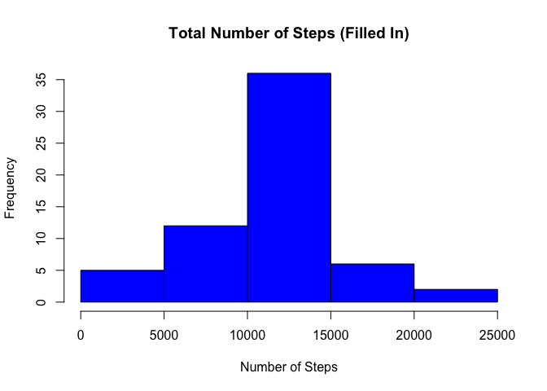

This small chunk is for saving away image files that are produced.

    knitr::opts_chunk$set(
      fig.path = "figures/")

Read in the activity data set
=============================

    setwd("/Users/adamwinter/R_Analytics/Data/")
    data <- read.csv("activity.csv")
    str(data)

    ## 'data.frame':    17568 obs. of  3 variables:
    ##  $ steps   : int  NA NA NA NA NA NA NA NA NA NA ...
    ##  $ date    : Factor w/ 61 levels "2012-10-01","2012-10-02",..: 1 1 1 1 1 1 1 1 1 1 ...
    ##  $ interval: int  0 5 10 15 20 25 30 35 40 45 ...

    head(data)

    ##   steps       date interval
    ## 1    NA 2012-10-01        0
    ## 2    NA 2012-10-01        5
    ## 3    NA 2012-10-01       10
    ## 4    NA 2012-10-01       15
    ## 5    NA 2012-10-01       20
    ## 6    NA 2012-10-01       25

Find mean total number of steps taken per day
=============================================

First add up steps on each day

    stepTotals <- aggregate(data$steps ~ data$date, FUN = sum)
    colnames(stepTotals) <- c("date","steps")

Then, make a histogram with the totals

    hist(stepTotals$steps, breaks = 5, col = 4, axes = TRUE, 
         main = "Total Number of Steps", xlab = "Number of Steps")

 Calculate mean and median of the
total number of steps taken per day

    avg <- mean(stepTotals$steps)
    med <- median(stepTotals$steps)
    #values are displayed in the text below

The mean is 1.076618910^{4} and the median is 10765

What is the average daily activity pattern?
===========================================

Collapse data to a new data frame with the inteval and average number of
steps

    intervals <- aggregate(data$steps ~ data$interval,FUN = mean)
    colnames(intervals) <- c("interval","steps")

Graph the time series plot

    plot(intervals$interval,intervals$steps, type = "l", col = 1,
         main = "Average number of steps across all days", 
         xlab = "Intervals", ylab = "Average number of steps")

 Find interval with maximum average
number of steps

    maxSteps <-sort(intervals$steps, decreasing = TRUE)[1]
    maxInt <- as.numeric(intervals[intervals$steps == maxSteps,][1])
    #The value is embeded and displayed in the text below

The 5-minute interval at 835 contains the maximum number of steps of
206.1698113.

Imputing missing values
=======================

Calculate and report the total number of missing values in the dataset
(i.e. the total number of rows with NAs).

    #sum(is.na(data$date)) and sum(is.na(data$interval)) show
    #that the only column with NA values is data$steps
    numNA <- sum(is.na(data$steps))

The number of rows with NAs is 2304.

Now, I create a new dataset that is equal to the original dataset but
with the missing data filled in. I replace NA with the average value for
the given 5-minute interval across all the days. Average steps for each
5-minute interval are already caluclated in `intervals`.

    fillData <- data
    for(i in 1:nrow(data))
    {
        if(is.na(data$steps[i]))    #row is missing steps
        {
            #get the interval of that row
            interval_val <- data$interval[i]
            #find the row in intervals with the avg steps for interval_val
            row_val <- which(intervals$interval == interval_val)
            #find the number of steps in that row
            avgSteps <- intervals$steps[row_val]
            #replace the NA value
            fillData$steps[i] <- avgSteps
        }
    }
    #Check that we got all of them by sum(is.na(fillData$steps)) == 0

Add up steps on each day.

    fillStepTotals <- aggregate(fillData$steps ~ fillData$date, FUN = sum)
    colnames(fillStepTotals) <- c("date","steps")

Make a histogram of the total number of steps taken each day.

    hist(fillStepTotals$steps, breaks = 5, col = 4, axes = TRUE, 
        main = "Total Number of Steps (Filled In)", xlab = "Number of Steps")

 Calculate mean and median steps for
the new filled in data.

    fillAvg <- mean(fillStepTotals$steps)
    fillMed <- median(fillStepTotals$steps)
    #values are displayed in the text below

The new filled-data mean is 1.076618910^{4} and the new filled-data
median is 1.076618910^{4}.  
The old incomplete data mean was 1.076618910^{4} and the median was
10765.

Therefore, filling in the NA step values with the average number of
steps in that 5-minute interval had the effect of making the median
equal the mean. The NA values were not spred throughout the data but
rather isolated to every interval on a few select days. When the values
were filled, thier sum was equal to the mean and caused the curve to be
more centralized, which caused a shift in the median.

Are there differences in activity patterns between weekdays and weekends?
=========================================================================

The `weekdays()` function is helpful for this part. It takes a date and
returns the day of the week as a string. We are using the filled dataset
without missing values.

     #Create a vector with the day of the week for each date.
    day <- weekdays(as.Date(fillData$date))
    dayType <- vector()
    for(i in 1:nrow(fillData))  #fill the dayType vector based on day
    {
        if(day[i] == "Saturday" || day[i] == "Sunday")
            dayType[i] <- "weekend"
        else
            dayType[i] <- "weekday"
    }

    fillData$dayType <- dayType
    # make new column a factor variable with levels of "weekday" and "weekend"
    fillData$dayType <- factor(fillData$dayType)  

Create a table that has the average number of steps taken, averaged
across all weekday days or weekend days, at each interval.

    intervalsByDay <- aggregate(steps ~ interval + dayType, data = fillData, FUN = mean)
    #Take a look at the new table
    head(intervalsByDay)

    ##   interval dayType      steps
    ## 1        0 weekday 2.25115304
    ## 2        5 weekday 0.44528302
    ## 3       10 weekday 0.17316562
    ## 4       15 weekday 0.19790356
    ## 5       20 weekday 0.09895178
    ## 6       25 weekday 1.59035639

Make a panel plot containing a time series plot of the average numeber
of steps at each interval of that dayType. I am using the lattice
plotting system.

    library(lattice)
    xyplot(steps ~ interval | dayType, data = intervalsByDay, type = "l", layout = c(1,2), xlab = "Interval", ylab = "Number of Steps")

